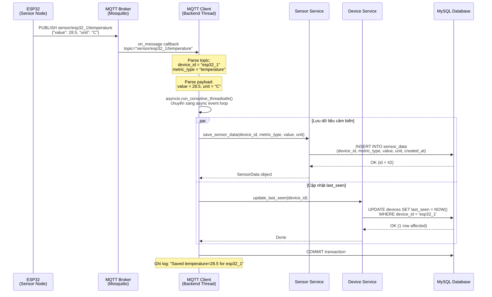
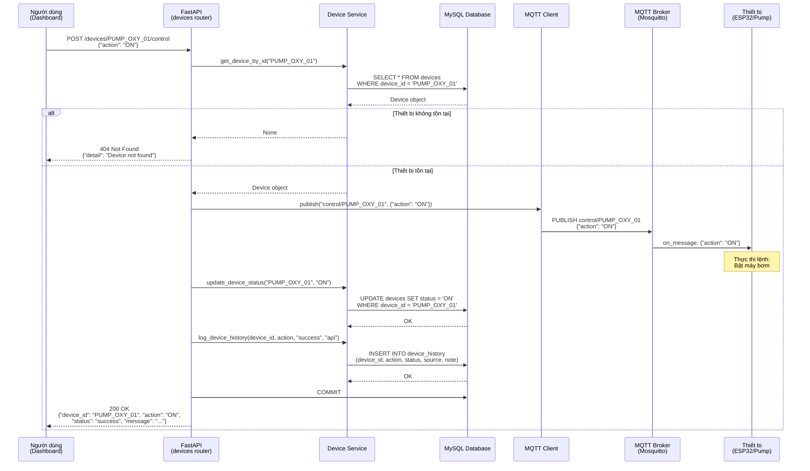
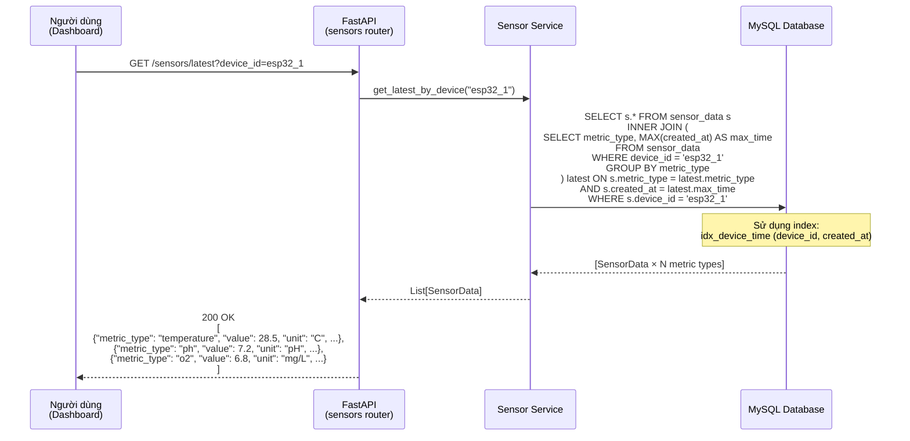
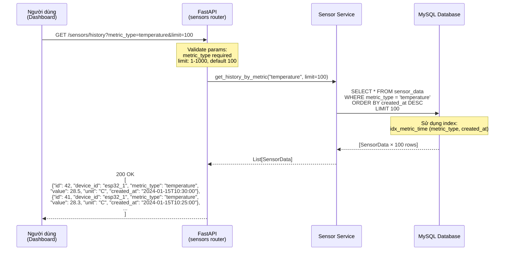
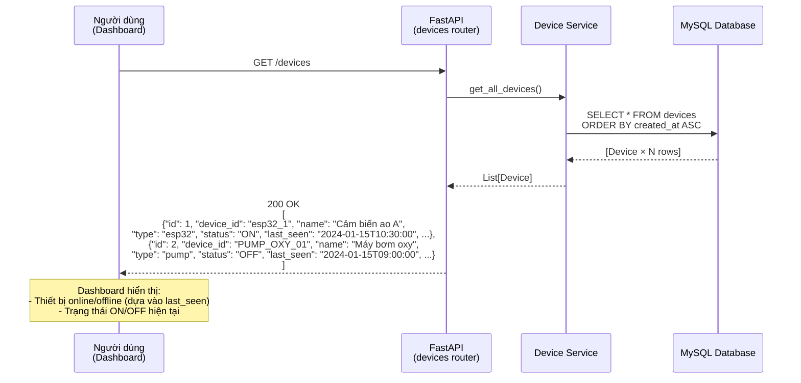
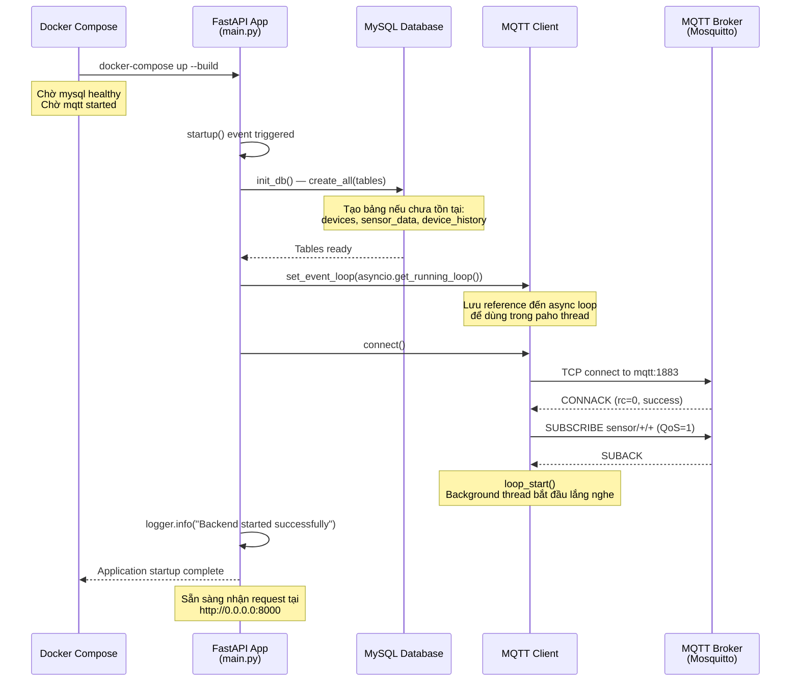
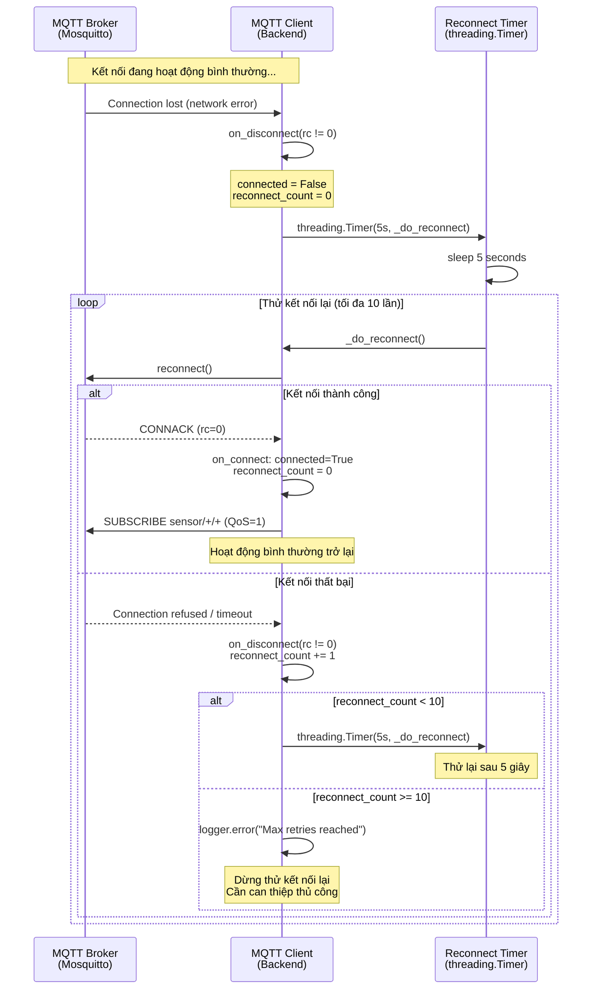

# Sơ đồ Tuần tự (Sequence Diagrams)
## Hệ thống Giám sát và Điều khiển Môi trường Nuôi trồng Thủy sản IoT

---

## Danh sách các chức năng chính

| STT | Chức năng | Mô tả |
|-----|-----------|-------|
| SD-01 | Nhận và lưu dữ liệu cảm biến | ESP32 gửi dữ liệu qua MQTT, backend lưu vào DB |
| SD-02 | Điều khiển thiết bị (ON/OFF) | Người dùng gửi lệnh qua API, backend publish MQTT |
| SD-03 | Xem dữ liệu cảm biến mới nhất | Dashboard truy vấn giá trị hiện tại của thiết bị |
| SD-04 | Xem lịch sử cảm biến | Dashboard truy vấn time-series theo loại chỉ số |
| SD-05 | Xem danh sách thiết bị | Dashboard lấy toàn bộ danh sách thiết bị |
| SD-06 | Kết nối MQTT khi khởi động | Backend khởi động và thiết lập kết nối MQTT |
| SD-07 | Tự động kết nối lại MQTT | Xử lý mất kết nối và reconnect tự động |

---

## SD-01: Nhận và lưu dữ liệu cảm biến

**Mô tả:** ESP32 định kỳ đo các chỉ số môi trường và gửi lên MQTT Broker. Backend lắng nghe, parse dữ liệu và lưu vào cơ sở dữ liệu.



**Luồng xử lý chính:**
1. ESP32 publish message lên topic `sensor/{device_id}/{metric_type}`
2. MQTT Broker forward message đến tất cả subscriber
3. Backend nhận qua callback `on_message` (chạy trên paho thread)
4. Dùng `asyncio.run_coroutine_threadsafe` để gọi async DB service từ sync thread
5. Thực hiện song song: INSERT sensor_data + UPDATE devices.last_seen
6. Commit transaction

---

## SD-02: Điều khiển thiết bị

**Mô tả:** Người dùng gửi lệnh điều khiển qua REST API. Backend publish lệnh qua MQTT đến thiết bị, cập nhật trạng thái và ghi log.



**Lưu ý:**
- Chỉ cập nhật `devices.status` khi action là `ON` hoặc `OFF`
- Các action `FEED`, `RESET`, `CHANGE_WATER` chỉ publish MQTT và ghi log, không đổi status
- Nếu publish MQTT thất bại, vẫn ghi log với `status = 'failed'`

---

## SD-03: Xem dữ liệu cảm biến mới nhất

**Mô tả:** Dashboard lấy giá trị đo lường mới nhất của từng loại chỉ số cho một thiết bị cụ thể.



**Kỹ thuật query:**
Dùng subquery với `GROUP BY metric_type` + `MAX(created_at)` để lấy đúng 1 bản ghi mới nhất cho mỗi loại chỉ số, tránh N+1 query.

---

## SD-04: Xem lịch sử cảm biến (Time-series)

**Mô tả:** Dashboard lấy chuỗi dữ liệu lịch sử của một loại chỉ số để vẽ biểu đồ.



---

## SD-05: Xem danh sách thiết bị

**Mô tả:** Dashboard lấy toàn bộ danh sách thiết bị kèm trạng thái hiện tại.



---

## SD-06: Khởi động hệ thống và kết nối MQTT

**Mô tả:** Quá trình khởi động backend — khởi tạo DB và thiết lập kết nối MQTT.



---

## SD-07: Tự động kết nối lại MQTT (Reconnect)

**Mô tả:** Khi mất kết nối đến MQTT Broker, hệ thống tự động thử kết nối lại sau 5 giây, tối đa 10 lần.



---

## Tổng hợp các thành phần tham gia

```
┌─────────────┐    ┌──────────────┐    ┌─────────────────┐    ┌──────────────┐
│    ESP32    │    │ MQTT Broker  │    │  FastAPI Backend │    │    MySQL     │
│ Sensor Node │    │  Mosquitto   │    │                  │    │  Database    │
└──────┬──────┘    └──────┬───────┘    └────────┬─────────┘    └──────┬───────┘
       │                  │                     │                     │
       │  SD-01: Gửi data │                     │                     │
       │─────────────────►│                     │                     │
       │                  │────────────────────►│                     │
       │                  │                     │────────────────────►│
       │                  │                     │                     │
       │                  │◄────────────────────│  SD-02: Nhận lệnh   │
       │◄─────────────────│                     │                     │
       │                  │                     │────────────────────►│
       │                  │                     │                     │
       │                  │         SD-03/04/05: Query data           │
       │                  │                     │◄────────────────────│
       │                  │                     │                     │
```

| Thành phần | Vai trò | Giao thức |
|------------|---------|-----------|
| **ESP32** | Thu thập và gửi dữ liệu cảm biến | MQTT (publish) |
| **MQTT Broker** | Trung gian nhận/phân phối message | MQTT |
| **FastAPI Backend** | Xử lý logic nghiệp vụ, REST API | HTTP/MQTT |
| **MySQL Database** | Lưu trữ dữ liệu bền vững | SQL/TCP |
| **Dashboard** | Giao diện người dùng | HTTP REST |
