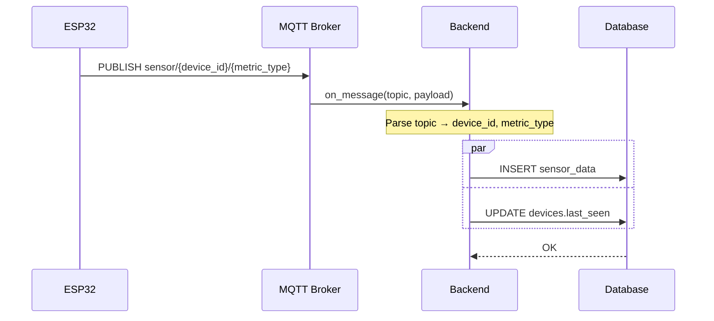
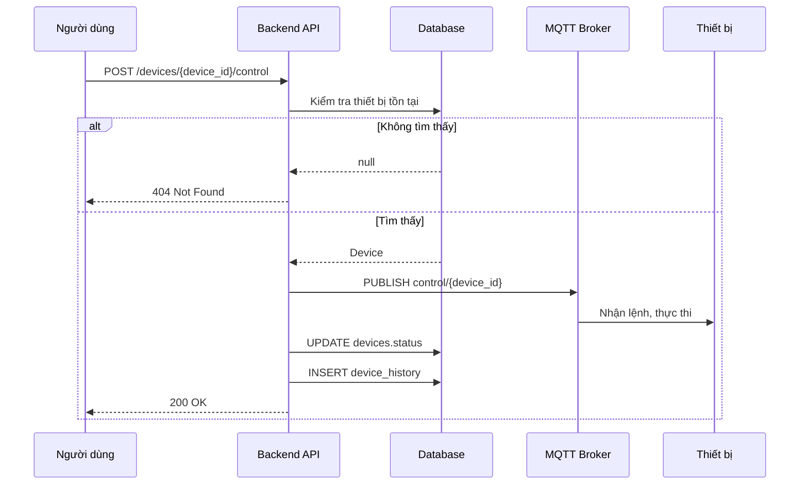
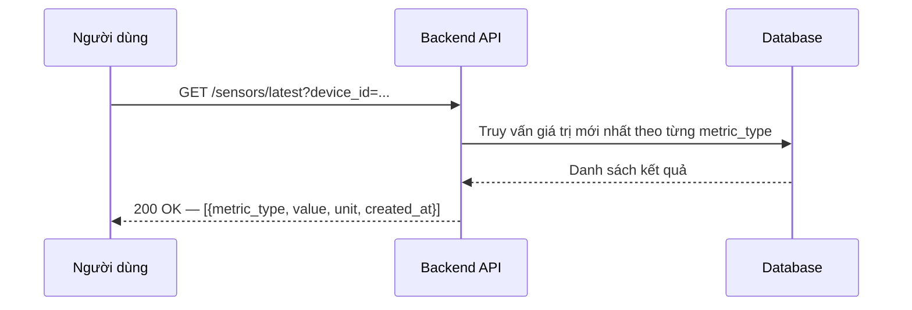
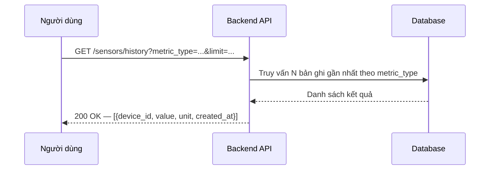
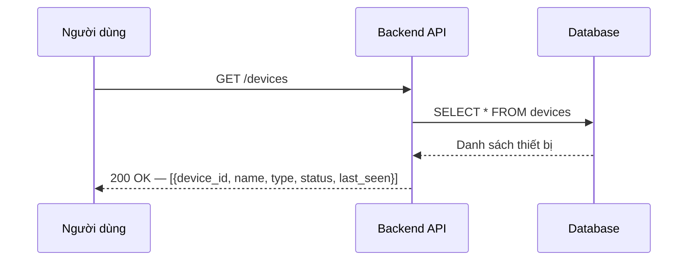
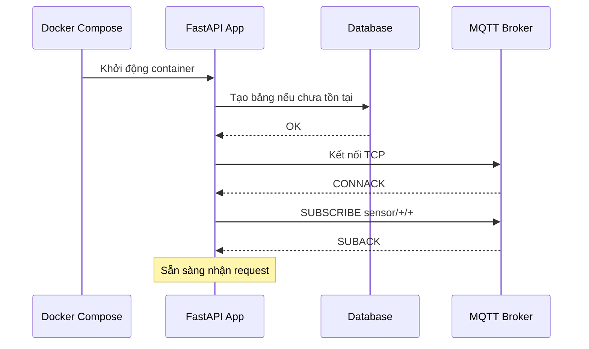
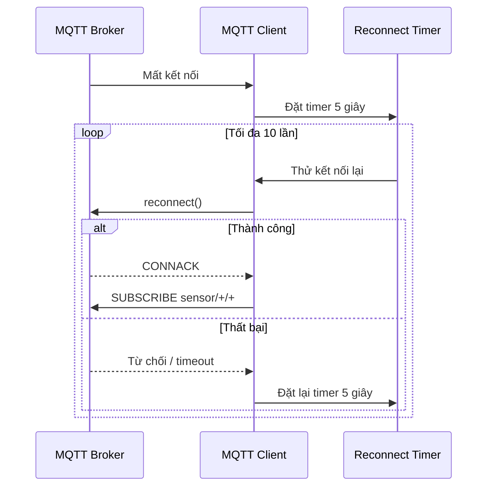

# Sơ đồ Tuần tự (Sequence Diagrams)
## Hệ thống Giám sát và Điều khiển Môi trường Nuôi trồng Thủy sản IoT

---

## Danh sách các chức năng chính

| STT | Chức năng | Mô tả |
|-----|-----------|-------|
| SD-01 | Nhận và lưu dữ liệu cảm biến | ESP32 gửi dữ liệu qua MQTT, backend lưu vào DB |
| SD-02 | Điều khiển thiết bị | Người dùng gửi lệnh qua API, backend publish MQTT |
| SD-03 | Xem dữ liệu cảm biến mới nhất | Dashboard truy vấn giá trị hiện tại của thiết bị |
| SD-04 | Xem lịch sử cảm biến | Dashboard truy vấn time-series theo loại chỉ số |
| SD-05 | Xem danh sách thiết bị | Dashboard lấy toàn bộ danh sách thiết bị |
| SD-06 | Khởi động hệ thống | Backend khởi động và thiết lập kết nối MQTT |
| SD-07 | Tự động kết nối lại MQTT | Xử lý mất kết nối và reconnect tự động |

---

## SD-01: Nhận và lưu dữ liệu cảm biến

ESP32 định kỳ đo các chỉ số môi trường và gửi lên MQTT Broker. Backend lắng nghe, parse dữ liệu và lưu vào cơ sở dữ liệu.

```mermaid
sequenceDiagram
    participant ESP32 as ESP32
    participant Broker as MQTT Broker
    participant Backend as Backend
    participant DB as Database

    ESP32->>Broker: PUBLISH sensor/{device_id}/{metric_type}
    Broker->>Backend: on_message(topic, payload)
    Note over Backend: Parse topic → device_id, metric_type
    par
        Backend->>DB: INSERT sensor_data
    and
        Backend->>DB: UPDATE devices.last_seen
    end
    DB-->>Backend: OK
```

---

## SD-02: Điều khiển thiết bị

Người dùng gửi lệnh điều khiển qua REST API. Backend publish lệnh qua MQTT đến thiết bị, cập nhật trạng thái và ghi log.

```mermaid
sequenceDiagram
    participant User as Người dùng
    participant API as Backend API
    participant DB as Database
    participant Broker as MQTT Broker
    participant Device as Thiết bị

    User->>API: POST /devices/{device_id}/control
    API->>DB: Kiểm tra thiết bị tồn tại

    alt Không tìm thấy
        DB-->>API: null
        API-->>User: 404 Not Found
    else Tìm thấy
        DB-->>API: Device
        API->>Broker: PUBLISH control/{device_id}
        Broker->>Device: Nhận lệnh, thực thi
        API->>DB: UPDATE devices.status
        API->>DB: INSERT device_history
        API-->>User: 200 OK
    end
```

---

## SD-03: Xem dữ liệu cảm biến mới nhất

Dashboard lấy giá trị đo lường mới nhất của từng loại chỉ số cho một thiết bị.

```mermaid
sequenceDiagram
    participant User as Người dùng
    participant API as Backend API
    participant DB as Database

    User->>API: GET /sensors/latest?device_id=...
    API->>DB: Truy vấn giá trị mới nhất theo từng metric_type
    DB-->>API: Danh sách kết quả
    API-->>User: 200 OK — [{metric_type, value, unit, created_at}]
```

---

## SD-04: Xem lịch sử cảm biến

Dashboard lấy chuỗi dữ liệu lịch sử của một loại chỉ số để vẽ biểu đồ.

```mermaid
sequenceDiagram
    participant User as Người dùng
    participant API as Backend API
    participant DB as Database

    User->>API: GET /sensors/history?metric_type=...&limit=...
    API->>DB: Truy vấn N bản ghi gần nhất theo metric_type
    DB-->>API: Danh sách kết quả
    API-->>User: 200 OK — [{device_id, value, unit, created_at}]
```

---

## SD-05: Xem danh sách thiết bị

Dashboard lấy toàn bộ danh sách thiết bị kèm trạng thái hiện tại.

```mermaid
sequenceDiagram
    participant User as Người dùng
    participant API as Backend API
    participant DB as Database

    User->>API: GET /devices
    API->>DB: SELECT * FROM devices
    DB-->>API: Danh sách thiết bị
    API-->>User: 200 OK — [{device_id, name, type, status, last_seen}]
```

---

## SD-06: Khởi động hệ thống

Quá trình khởi động backend — khởi tạo DB và thiết lập kết nối MQTT.

```mermaid
sequenceDiagram
    participant Docker as Docker Compose
    participant App as FastAPI App
    participant DB as Database
    participant Broker as MQTT Broker

    Docker->>App: Khởi động container
    App->>DB: Tạo bảng nếu chưa tồn tại
    DB-->>App: OK
    App->>Broker: Kết nối TCP
    Broker-->>App: CONNACK
    App->>Broker: SUBSCRIBE sensor/+/+
    Broker-->>App: SUBACK
    Note over App: Sẵn sàng nhận request
```

---

## SD-07: Tự động kết nối lại MQTT

Khi mất kết nối đến MQTT Broker, hệ thống tự động thử kết nối lại sau 5 giây, tối đa 10 lần.

```mermaid
sequenceDiagram
    participant Broker as MQTT Broker
    participant Client as MQTT Client
    participant Timer as Reconnect Timer

    Broker->>Client: Mất kết nối
    Client->>Timer: Đặt timer 5 giây

    loop Tối đa 10 lần
        Timer->>Client: Thử kết nối lại
        Client->>Broker: reconnect()

        alt Thành công
            Broker-->>Client: CONNACK
            Client->>Broker: SUBSCRIBE sensor/+/+
        else Thất bại
            Broker-->>Client: Từ chối / timeout
            Client->>Timer: Đặt lại timer 5 giây
        end
    end
```
