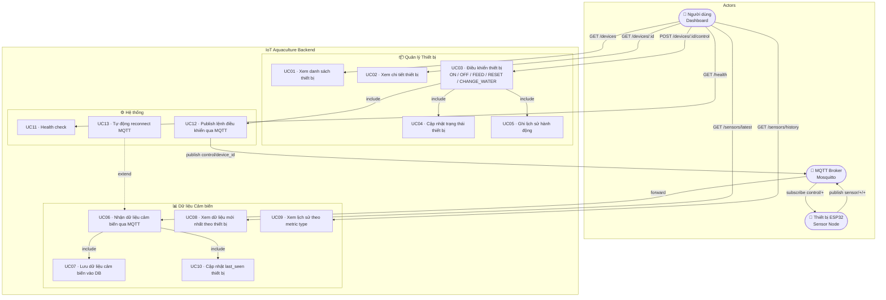

# Sơ đồ Use Case - Hệ thống Giám sát Nuôi trồng Thủy sản IoT

## Actors

| Actor | Mô tả |
|-------|-------|
| **Người dùng (Dashboard)** | Operator/admin tương tác qua REST API hoặc giao diện web |
| **Thiết bị ESP32** | Sensor node gửi dữ liệu môi trường qua MQTT |
| **MQTT Broker** | Eclipse Mosquitto — trung gian nhận/phân phối message |

---

## Sơ đồ



---

## Mô tả Use Cases

### Quản lý Thiết bị

| UC | Tên | Actor | Mô tả |
|----|-----|-------|-------|
| UC01 | Xem danh sách thiết bị | Người dùng | `GET /devices` — trả về tất cả thiết bị đã đăng ký |
| UC02 | Xem chi tiết thiết bị | Người dùng | `GET /devices/{device_id}` — trả về thông tin 1 thiết bị |
| UC03 | Điều khiển thiết bị | Người dùng | `POST /devices/{device_id}/control` — gửi lệnh ON/OFF/FEED/RESET/CHANGE_WATER |
| UC04 | Cập nhật trạng thái | System | **include** UC03 — cập nhật `devices.status` khi action là ON/OFF |
| UC05 | Ghi lịch sử hành động | System | **include** UC03 — insert vào `device_history` với source=api |

### Dữ liệu Cảm biến

| UC | Tên | Actor | Mô tả |
|----|-----|-------|-------|
| UC06 | Nhận dữ liệu MQTT | MQTT Broker | Subscribe `sensor/+/+`, parse topic → device_id + metric_type |
| UC07 | Lưu vào DB | System | **include** UC06 — insert vào `sensor_data` |
| UC08 | Xem dữ liệu mới nhất | Người dùng | `GET /sensors/latest?device_id=` — giá trị mới nhất mỗi metric |
| UC09 | Xem lịch sử metric | Người dùng | `GET /sensors/history?metric_type=` — time series data |
| UC10 | Cập nhật last_seen | System | **include** UC06 — cập nhật `devices.last_seen` |

### Hệ thống

| UC | Tên | Actor | Mô tả |
|----|-----|-------|-------|
| UC11 | Health check | Người dùng | `GET /health` — kiểm tra backend đang chạy |
| UC12 | Publish MQTT command | System | **include** UC03 — publish `{"action": "ON"}` tới `control/{device_id}` |
| UC13 | Auto reconnect MQTT | System | **extend** UC06 — tự kết nối lại khi mất kết nối broker |

---

## Luồng chính: Điều khiển thiết bị (UC03)

```
Người dùng
    │
    ▼
POST /devices/esp32_1/control  {"action": "ON"}
    │
    ├─► [UC12] Publish MQTT → control/esp32_1  {"action": "ON"}
    │       │
    │       └─► ESP32 nhận lệnh, thực thi
    │
    ├─► [UC04] UPDATE devices SET status='ON' WHERE device_id='esp32_1'
    │
    └─► [UC05] INSERT device_history (action=ON, status=success, source=api)
```

## Luồng chính: Nhận dữ liệu cảm biến (UC06)

```
ESP32
    │
    ▼
MQTT publish → sensor/esp32_1/temperature  {"value": 28.5, "unit": "C"}
    │
    ▼
MQTT Broker (Mosquitto)
    │
    ▼
Backend on_message callback
    │
    ├─► [UC07] INSERT sensor_data (device_id=esp32_1, metric_type=temperature, value=28.5)
    │
    └─► [UC10] UPDATE devices SET last_seen=NOW() WHERE device_id='esp32_1'
```
